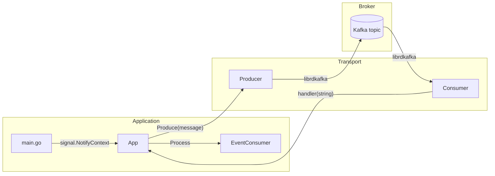
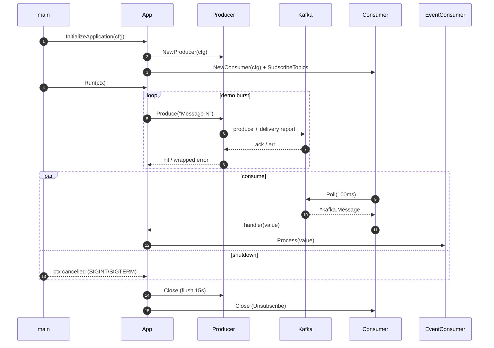

# kafka

> A minimal, production-ready Kafka producer + consumer scaffold in Go, built on top of [`confluent-kafka-go`](https://github.com/confluentinc/confluent-kafka-go) (librdkafka). Configuration via Viper + env, graceful shutdown via `signal.NotifyContext`, delivery-confirmed produces, fatal-aware consume loop.

[](https://github.com/Chetas-Patil/kafka/actions/workflows/ci.yml)
[](https://github.com/Chetas-Patil/kafka/actions/workflows/security.yml)
[](https://go.dev/dl/)
[](https://kafka.apache.org)

---

## Why this exists

A reference Go skeleton you can copy into a service that needs to publish and consume Kafka messages, with the ergonomics that tend to be missing from "hello-world" examples:

- **Delivery-confirmed produces.** `Produce` waits on a per-message delivery channel and returns the broker error if any (unknown topic, auth failure, replication NACK).
- **Bounded `Close`/flush.** `Producer.Close()` flushes with a 15s budget and reports the count of undelivered messages instead of silently dropping.
- **Cancellable consume loop.** `Consumer.Consume(ctx, handler)` polls with a 100ms timeout and returns when `ctx` is cancelled, distinguishing fatal client-side errors from transient ones.
- **Single-shot config loader.** Viper reads `config/config-local.yaml` once and applies env overrides (`KAFKA_BROKER`, `KAFKA_USERNAME`, `KAFKA_PASSWORD`, ...). No globals, no `init()` magic.
- **`signal.NotifyContext` shutdown.** SIGINT / SIGTERM cancels the context; deferred `Close()` flushes the producer and unsubscribes the consumer before exit.

## Architecture



## Lifecycle



## Configuration

`config/config-local.yaml` (committed with **empty** credentials — never check real ones in):

```yaml
Kafka:
  broker: localhost:9092
  username: ""
  password: ""

KafkaProducer:
  topic: produce_events

KafkaConsumer:
  topic: consume_events
  group: consume_group
```

Env overrides via Viper's `AutomaticEnv`:

| Env var               | Maps to                |
|-----------------------|------------------------|
| `KAFKA_BROKER`        | `Kafka.Broker`         |
| `KAFKA_USERNAME`      | `Kafka.Username`       |
| `KAFKA_PASSWORD`      | `Kafka.Password`       |
| `KAFKAPRODUCER_TOPIC` | `KafkaProducer.Topic`  |
| `KAFKACONSUMER_TOPIC` | `KafkaConsumer.Topic`  |
| `KAFKACONSUMER_GROUP` | `KafkaConsumer.Group`  |

## Operational Notes

- **Auth.** Hard-wired to `SASL_PLAINTEXT` + `PLAIN` for compatibility with the configured local broker. For production, switch `security.protocol` to `SASL_SSL` and pin the broker CA. (Open an issue / PR — happy to make this configurable.)
- **At-most-once vs. at-least-once.** This skeleton commits offsets via the consumer's default policy (`enable.auto.commit=true`). Switch to manual commits in `Consumer.Consume` if you need at-least-once semantics with retries.
- **Backpressure.** `Produce` is synchronous (waits on delivery report). For high-throughput producers, consider an internal `chan kafka.Message` and a single goroutine that drains delivery reports.
- **Fatal errors.** `Consume` propagates fatal `kafka.Error.IsFatal()` events; `App.Run` translates them into a non-zero exit so an orchestrator (k8s, systemd) can restart cleanly.

## Security Considerations

- **Credentials.** Source from env vars or a secret manager — never the YAML file. The committed YAML uses empty placeholders.
- **TLS.** `SASL_PLAINTEXT` is acceptable only for in-cluster development. Production must use `SASL_SSL` with broker certificate validation.
- **Schema trust.** `EventConsumer.Process` should validate any deserialized payload before acting on it (size, fields, type).
- **Image.** Build images on a slim base (`alpine` or `distroless`); librdkafka is statically linked by the `confluent-kafka-go` `bundled` build (default), so the binary is self-contained.

## Roadmap

| Item | Status |
|---|---|
| Producer delivery confirmation | ✅ |
| Cancellable consumer loop | ✅ |
| Graceful shutdown (signal.NotifyContext) | ✅ |
| Switch SASL protocol via config (`SSL` vs `PLAINTEXT`) | ⏳ |
| Manual offset commits + DLQ topic | ⏳ |
| Integration tests with `testcontainers-go` | ⏳ |
| OpenTelemetry tracing (producer + consumer span context propagation) | ⏳ |
| Prometheus metrics (queue depth, consumer lag) | ⏳ |

## Development

`librdkafka` 1.9.0+ (or the bundled static lib) is required to build:

```bash
# Linux: install librdkafka headers (the build also accepts the bundled static
# librdkafka shipped with confluent-kafka-go — see "Building").
sudo apt-get install -y librdkafka-dev pkg-config

# Build (CGO required)
CGO_ENABLED=1 go build ./...

# Run with a local Kafka (e.g. via docker-compose with bitnami/kafka)
KAFKA_BROKER=localhost:9092 go run .

# Lint / vet / vuln-scan
go vet ./...
golangci-lint run
govulncheck ./...
```

### Building without system librdkafka

`confluent-kafka-go` v1.9+ ships a bundled static librdkafka, so a system install is not strictly required:

```bash
CGO_ENABLED=1 go build ./...   # static-bundled librdkafka by default
```

To explicitly link against the system library (smaller binary, faster builds):

```bash
CGO_ENABLED=1 go build -tags dynamic ./...
```

## License

See [LICENSE](LICENSE).
